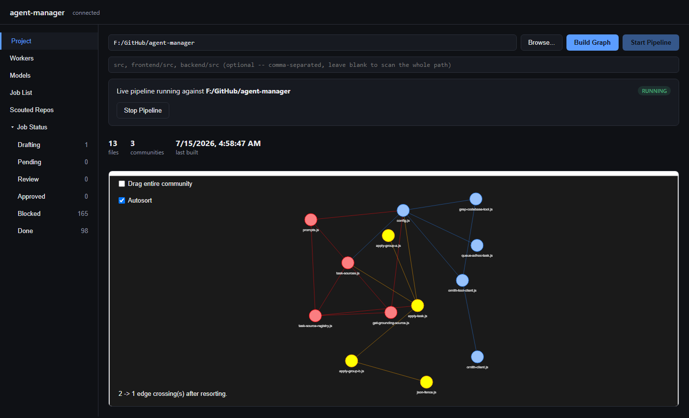
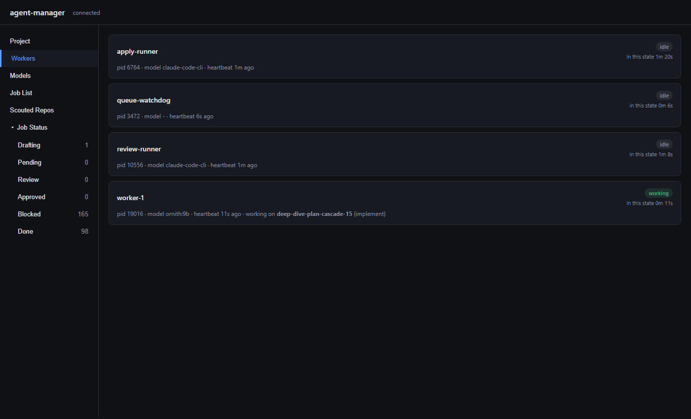
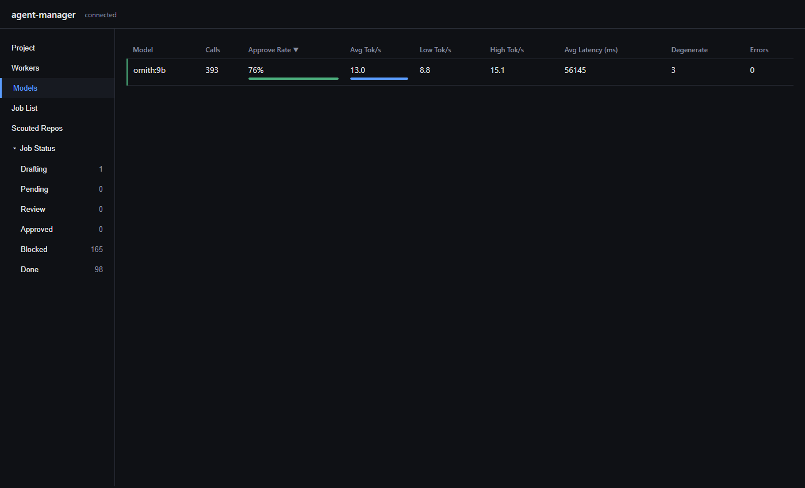
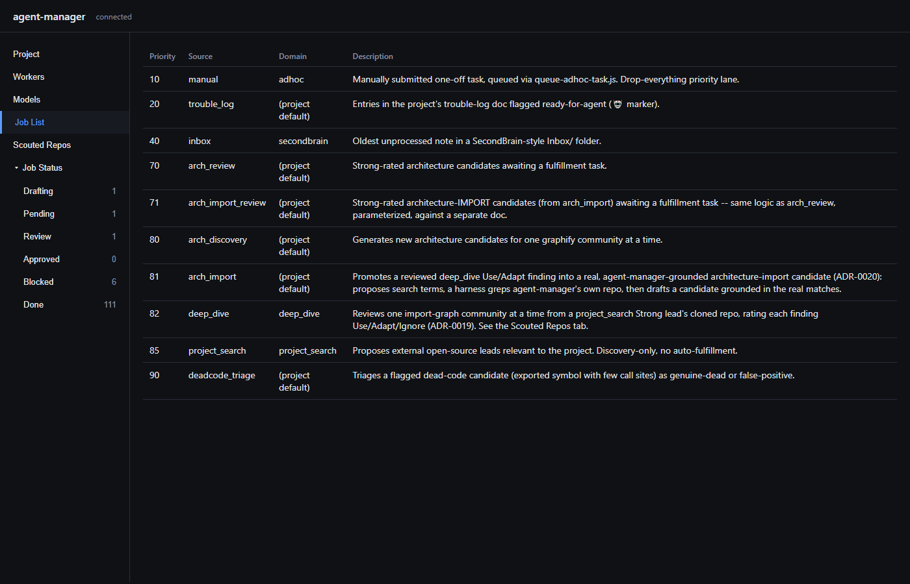
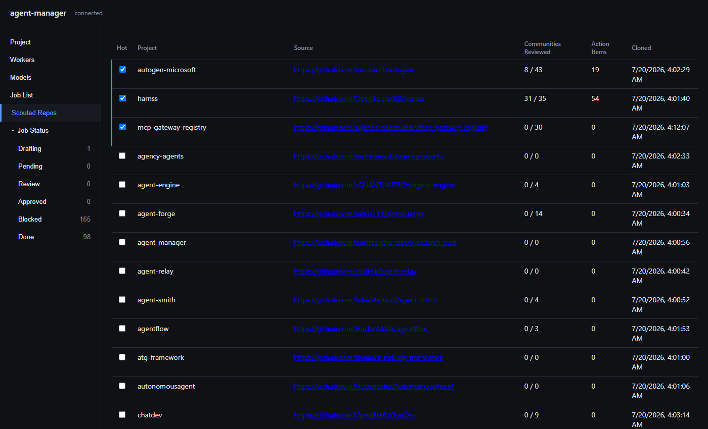

# agent-manager

An unattended Plan → Draft → Review → Apply pipeline for delegating coding/documentation
tasks to a local LLM (via [Ollama](https://ollama.com)), with a deterministic (no-LLM)
apply step and a plugin registry for task sources. Extracted from a real, live-running
production pipeline — every mechanism here was proven against real work before extraction,
not designed in the abstract.

## Why this exists

Point an always-on local model at a backlog of small, well-scoped tasks (architecture
findings, issue-tracker tickets, county/vendor-adapter completeness gaps, one-off ad-hoc
requests) and let it draft, self-critique, and get reviewed — with every actual file write
and git operation done by deterministic code, never by the model itself. A human (or a
second, more capable model) only has to review pushed branches, not babysit the loop.

## Architecture

Four always-on processes, each in its own terminal:

- **`ornith-worker.ps1`** — claims a pending task, runs a Plan pass, an Implement pass, and
  an independent Critique/Revision pass, then hands the draft to review.
- **`review-runner.ps1`** — a majority-vote model call judges each draft APPROVE/REJECT.
  APPROVE moves the task to `queue/approved/`; nothing is written or pushed yet.
- **`apply-runner.ps1`** — the only process with real file-write/git capability. Executes
  an approved task deterministically (see `apply-group-a.js`/`apply-group-b.js`). Its
  git-branch-diff path resets the working tree onto `origin/<default-branch>` before
  branching (`git-runner.js`'s `resetToMain()`) — auto-stashes any uncommitted work first
  (`git stash push -u`) rather than destroying it, since `AGENT_MANAGER_REPO_ROOT` can be
  (and for this package's own dev loop, is) a directory also being edited live.
- **`queue-watchdog.ps1`** — dead-process detection (restarts a crashed loop) and
  reject-retry-requeue (a genuinely rejected draft gets one bounded redraft attempt).

State lives entirely in a filesystem queue (`queue/pending/`, `queue/review/`,
`queue/approved/`, `queue/blocked/`, `queue/done/`) plus per-process heartbeat files in
`instances/` — no database required, though a consumer can mirror events into one (see
`agent-task-db.js` — not part of this package; add your own via `Invoke-TaskDb`'s
convention of a no-op when the script is absent).

## Configuration

This package has no config *file* of its own — everything is env vars, following the same
convention the underlying model client already used. Set these before launching any script:

| Var | Required | Meaning |
|---|---|---|
| `AGENT_MANAGER_REPO_ROOT` | **yes** | Absolute path to the repo this pipeline operates on. |
| `AGENT_MANAGER_PIPELINE_DIR` | no (defaults to `REPO_ROOT`) | Where `queue/`, `instances/`, and your own local task-source/applier scripts live. |
| `AGENT_MANAGER_REGISTER_PATH` | no | Path to a script the CLI entry points `require()` once, for its side effect of calling `registerTaskSource`/`updateTaskSource` for your project-specific sources. |
| `SECOND_BRAIN_DIR` | no | A personal-notes vault, if you use the `secondbrain` built-in source. |
| `AGENT_MANAGER_GREP_DIRS` | no (default `frontend/src,backend/src`) | Comma-separated dirs the `grep_codebase` tool is allowed to search. |
| `AGENT_MANAGER_TROUBLE_LOG_PATH` | no (default `<repoRoot>/Docs/TROUBLE_LOG.md`) | Issue-tracker doc for the `trouble_log` source. |
| `AGENT_MANAGER_ARCH_CANDIDATES_PATH` | no (default `<repoRoot>/Docs/ARCH_REVIEW_CANDIDATES.md`) | Architecture-candidates doc for `arch_review`/`arch_discovery`. |
| `AGENT_MANAGER_COMMUNITY_COVERAGE_PATH` | no (default `<pipelineDir>/community-coverage.json`) | Rotation state for `arch_discovery`. |
| `AGENT_MANAGER_GRAPH_PATH` | no (default `<repoRoot>/graphify-out/graph.json`) | A [graphify](https://github.com)-style codebase graph for `arch_discovery`. |
| `AGENT_MANAGER_DOMAINS_PATH` | no (default `<pipelineDir>/task-domains.json`) | Your domain config (see below). |
| `AGENT_MANAGER_DEFAULT_DOMAIN` | no (default `default`) | The domain name stamped on tasks generated by `trouble_log`/`arch_review`/`arch_discovery`/`unused_export` -- must match a real key in your domains config. `adhoc` and `secondbrain` are a fixed contract, not affected by this. |
| `AGENT_MANAGER_COMPARE_URL_BASE` | no | e.g. `https://github.com/you/repo/compare/main...` — appended with the pushed branch name in log output. |
| `OLLAMA_URL` | no (default `http://localhost:11434`) | |
| `ORNITH_MODEL` | no (default `ornith:9b`) | Ollama model tag. |
| `ORNITH_AB_MODELS` | no (default unset -- A/B off) | Comma-separated candidate model tags for a same-stage A/B test of the worker's implement pass. A task deterministically hashes to one candidate (stable across redraft), so the same task always compares the same model. Only safe on a single worker instance -- Ollama keeps one model tier resident, so distinct candidate lists across concurrent instances would thrash the model cache the same way mixing `ORNITH_MODEL` tiers across instances would. |
| `AGENT_MANAGER_MODEL_STATS_DB_PATH` | no (default `<pipelineDir>/model-stats.db`) | SQLite DB tracking per-model-call outcome/performance/stability stats (see the dashboard's Models tab). The one deliberate exception to this package's no-database-required design -- per-model comparisons need to survive past individual tasks leaving the queue. |
| `REVIEW_PROVIDER` | no (default `ornith`) | Set to `claude` to use `claude -p` for a combined review+apply call instead. |

## Domains

`task-domains.json` (a file YOU own, at `AGENT_MANAGER_DOMAINS_PATH`) maps each task
`domain` to a work directory and a success-detection strategy:

```json
{
  "myproject": { "workDirKind": "repoRoot", "successCheck": "git-branch-diff" },
  "notes": { "workDirKind": "secondBrainDir", "successCheck": "done-marker" }
}
```

## Built-in task sources

Ten, at priorities 10/20/40/70/71/80/81/82/85/90 (30/50/60 left open for yours):

| Source | Priority | Reads |
|---|---|---|
| `adhoc` | 10 | `queue/adhoc/*.json` (submit via `queue-adhoc-task.js`) |
| `trouble_log` | 20 | `AGENT_MANAGER_TROUBLE_LOG_PATH`, entries flagged 🤖 |
| `secondbrain` | 40 | `SECOND_BRAIN_DIR/Inbox/*.md` |
| `arch_review` | 70 | `AGENT_MANAGER_ARCH_CANDIDATES_PATH`, entries rated Strong |
| `arch_import_review` | 71 | `AGENT_MANAGER_ARCH_IMPORT_CANDIDATES_PATH` (ADR-0020) — same fulfillment logic as `arch_review`, against `arch_import`'s own candidates doc |
| `arch_discovery` | 80 | `AGENT_MANAGER_GRAPH_PATH` + `AGENT_MANAGER_COMMUNITY_COVERAGE_PATH` — generates new candidates one graph community at a time |
| `arch_import` | 81 | `AGENT_MANAGER_IMPORT_COVERAGE_PATH` + deep_dive's analysis docs (ADR-0020) — promotes a reviewed `deep_dive` Use/Adapt finding into a real, agent-manager-grounded import candidate |
| `deep_dive` | 82 | Reviews one import-graph community at a time from a `project_search` Strong lead's cloned repo, rating each finding Use/Adapt/Ignore (ADR-0019) |
| `project_search` | 85 | Proposes external open-source leads relevant to the project. Discovery-only, no auto-fulfillment (ADR-0018) |
| `unused_export` | 90 | `queue/dead-code-flags.json` (produce this with your own scanner) |

## Building the codebase graph (`arch_discovery`'s input)

`arch_discovery` needs a `graph.json` (file nodes grouped into communities, with import
edges) and a `community-coverage.json` (rotation state) — see `python/`:

```
pip install -r python/requirements.txt
python python/build_graph.py          # writes graph.json + community-coverage.json
python python/visualize_graph.py       # writes an interactive HTML view of the graph, for humans
```

This is a self-contained, dependency-free (of *this* package) replacement for pointing at
an external graphify installation — it builds a **file-level** import/require graph
(JS/TS only, matching `grep_codebase`'s scope) and clusters it with `networkx`'s greedy
modularity community detection. Community names come from a quick call to the local model
(`OLLAMA_URL`/`ORNITH_MODEL`) per community, falling back to a shared-directory-prefix
heuristic if that call fails or times out.

Run it manually, periodically — it is **not** invoked automatically on every task-generation
tick, matching the `unused_export`/`gis_null_field`-style periodic-scanner pattern the rest
of this package already uses. **Rebuilding resets `community-coverage.json`'s rotation
progress** (community boundaries can genuinely shift between rebuilds, and a stale id
pointing at a different file set would silently corrupt tracking) — re-run only when you
actually want that reset, not reflexively. Also note: naming calls share the same Ollama
instance as any running drafting worker, so run this while the pipeline is idle for real
semantic names instead of directory-prefix fallbacks.

## Dashboard

A read-only monitoring page — no database, reads `queue/*.json` and `instances/*.json`
directly off disk, same as everything else in this package:

```
pip install -r python/requirements.txt
python python/dashboard/app.py
# open http://localhost:7420
```

Tabs for each worker/loop's live status (Workers) and every queue stage (Drafting,
Pending, Review, Approved, Blocked, Done) — click any task row for its full detail
(plan/implement text, blocked reason, branch). Polls every 5s. `AGENT_MANAGER_DASHBOARD_PORT`
picks the port (default `7420`).

### Tabs

**Project**



Pick and inspect any codebase, independent of whichever project the live pipeline is
actually pointed at. Browse the filesystem, click **Build Graph** to run `build_graph.py`
against it, and get the resulting file-level import graph rendered inline (drag nodes,
toggle **Drag entire community** / **Autosort**). Also shows the live pipeline's own
running/stopped status and a **Start Pipeline** / **Stop Pipeline** control.

Each browsed project's graph, layout, and node positions are cached inside that project
itself, under `.agent-manager-cache/<slug>/` (`<slug>` is `default`, or a short hash of
the `grepDirs` you scanned with if you gave any -- so browsing the same project with
different `grepDirs` gets its own independent cache instead of one overwriting the
other). Living inside the project means the same cached layout is available no matter
which agent-manager install or machine browses it -- add `.agent-manager-cache/` to that
project's own `.gitignore` if you don't want it tracked. (Caches from before this cache
moved inside the project, under `python/dashboard/project_cache/`, are migrated
automatically the first time each project loads.)

**Workers**



One card per always-on process (`ornith-worker`, `review-runner`, `apply-runner`,
`queue-watchdog`), read straight from their `instances/*.json` heartbeat files: pid, model,
last-heartbeat age, current status (idle/working/checking/stale), and — while a worker is
drafting — which task and pass (plan/implement/critique) it's actually working on. Click a
`working` card to jump straight to that task's detail, wherever it currently sits in the
queue.

**Models**



Per-model call statistics from `model-stats.db`: call count, approve rate, token
throughput (avg/low/high tok/s), average latency, and counts of degenerate/errored
responses. This is how an `ORNITH_AB_MODELS` comparison (or just tracking one model's
stability over time) gets judged — not vibes.

**Job List**



Every registered task source (built-in and custom), its priority, the domain it stamps on
generated tasks, and a one-line description of what it does — the same priority ordering
`task-sources.js` walks when picking the next task to draft.

**Scouted Repos**



The `deep_dive` pipeline's per-project rotation state (ADR-0019): every external repo
`project_search` has surfaced, how many of its import-graph communities have been reviewed,
how many actionable items came out of that review, and when it was cloned. Check **Hot** to
hotlist a project — hotlisted projects' communities always win the next `deep_dive` pick
over the plain oldest-reviewed-first rule. Click a row to see that project's communities and
drill into the Use/Adapt/Ignore-rated items an inline-expanded review produced for each one.

**Job Status** (Drafting / Pending / Review / Approved / Blocked / Done)

The six queue-stage tabs mirror `queue/*/` directly off disk — one row per task, click any
row for its full detail (plan/implement text, blocked reason, pushed branch).

## Registering a custom task source

```js
// your-project-sources.js -- pointed at by AGENT_MANAGER_REGISTER_PATH
const { registerTaskSource, updateTaskSource } = require('agent-manager/src/task-source-registry.js');

registerTaskSource('my_source', { priority: 30, next: myNextTaskFn });
updateTaskSource('my_source', {
  buildPlanPrompt: (task) => `...`,
  buildImplementPrompt: (task, planText) => `...`,
  apply: ({ implementResponse, repoRoot, pipelineDir, task }) => {
    // write files yourself, or fall through to the Group B default by not registering `apply` at all
    return { file: 'path/written.json' }; // or { files: [...] }
  },
  groundingFields: ['someField'], // or: extractGrounding: (promptContext, task) => '...'
});
```

If you don't register `buildImplementPrompt`, your source's implement pass emits the
generic Group B JSON change-object shape (`{mode: create|edit|delete, file, ...}`, or an
array of them) and gets applied by `apply-group-b.js` automatically — the default path,
and the one every built-in "real code change" source uses.

## Launching

**Windows (recommended): no config file needed.** `pip install -r python/requirements.txt`,
then run `launch.bat` — it starts the dashboard, no project configured yet. Open
`http://localhost:7420`, go to the **Project** tab, browse to your project's folder, and
click **Start Pipeline**. That's it: it writes `agent-manager.env` for you and launches all
4 pipeline loops as real, visible terminal windows (a local-LLM process dying silently in
the background is the one failure mode you can't see coming) — a **Stop Pipeline** button
appears once it's running. Re-running `launch.bat` later auto-starts the same project again,
since it remembers what you picked.

Power users who want non-default settings (`SECOND_BRAIN_DIR`, `AGENT_MANAGER_REGISTER_PATH`,
etc) can still copy `agent-manager.env.example` to `agent-manager.env` and hand-edit it
before running `launch.bat` — the Project tab's Start Pipeline only ever sets
`AGENT_MANAGER_REPO_ROOT`, so anything else you put in that file stays untouched.

**Manual / non-Windows terminal-by-terminal:**

```powershell
$env:AGENT_MANAGER_REPO_ROOT = 'C:\path\to\your\repo'
node .\src\task-sources.js  # optional one-shot smoke test
powershell -File .\src\ornith-worker.ps1 -InstanceId worker-1
powershell -File .\src\review-runner.ps1
powershell -File .\src\apply-runner.ps1
powershell -File .\src\queue-watchdog.ps1
```

## Testing

`npm test` runs the (currently small, growing) unit test suite via Node's built-in test
runner -- no extra dependency. Coverage starts with `apply-task.js`'s git sequencing (the
single place that actually mutates the consumer's real git repo), exercised against
`git-runner.js`'s fake adapter rather than a real repo/child_process.

## Drift scan

Some UI surfaces (currently: the dashboard's Job List tab) are hand-maintained text
mirroring a live registry elsewhere in the code, instead of being generated from it --
exactly the kind of thing that silently rots as the registry changes underneath it (found
live 2026-07-20: two newly-registered task sources were invisible in the tab for days).
`npm run drift-scan` is a deterministic, non-LLM set-difference check for exactly that --
no judgment calls, just "does every registered priority have a matching row." Run it
manually/periodically, same as `build_graph.py`; findings are written to
`<pipelineDir>/queue/drift-flags.json`, non-zero exit on any drift.

## License

MIT — see `LICENSE`.
